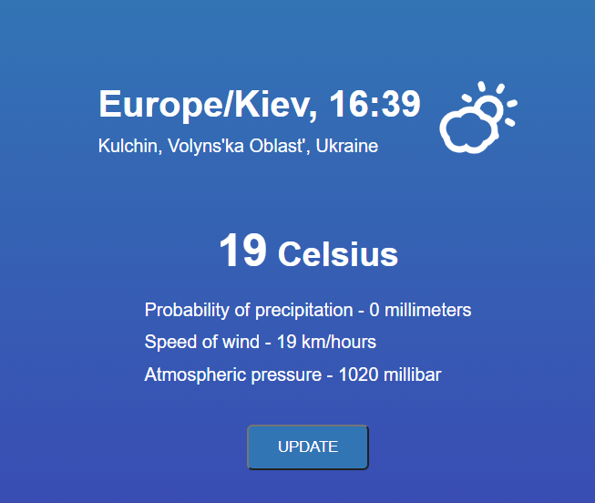

Simple weather web-application on javascript (weather in your location - using geolocation).

I used skycons for weather's icons and API weatherstack.com (free version).

 

Demonstration can be on localhost on your computer or on the real host, becouse weatherstack.com don't give access to the weather's data for Github Pages (consider as an insecure resource).
